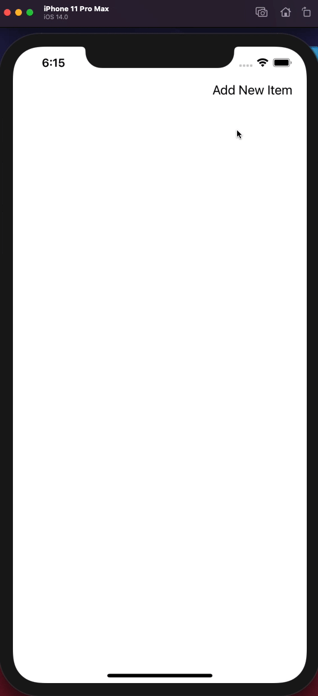

# GoodNotes Challenge

## Motivation
Using LWW-Element-Set to create a simple Shopping Note application. The idea is that family normally take note before going to shopping mall or super market. However, family members can use different type of devices to create note, edit note or remove accidentally created one.

## How to run application
1. Clone this repo
2. Run `Triet Le GoodNotes Challenge.xcodeproj`
3. Choose your preferred simulator
4. Run application
5. Enjoy!

## Demo

